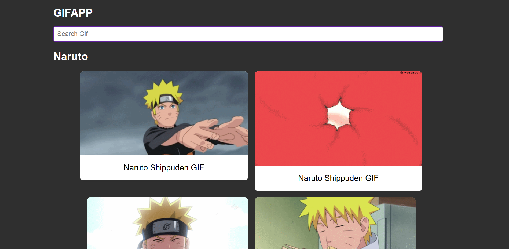

<h1 align="center"> GifApp </h1>

## Table of Contents

- [Projects](#projects)
- [Description](#description)
- [Installation](#installation)
- [Prerequisites](#prerequisites)
- [Scripts](#scripts)
- [Author](#author)


## Projects



Live: https://gifapp-update.netlify.app/

Repository: https://github.com/ismanolgarcia/GifApp


## Description


This project is an app to search for gifs, to make it use a gif api. In the construction of the project I learned how to consume an API and display the data.

## Installation

Download the project to your computer

```
git clone https://github.com/ismanolgarcia/GifApp.git
```

Type the yarn dev command to download the project dependencies


## Prerequisites

- Nodejs
- Yarn

## Technologies

- React
- Styled Component

## Scripts

The following scripts have been configured in this project to facilitate development, deployment, and preview:

```
yarn dev
```

Starts the development environment. This command launches a local server and allows real-time changes during development. It's useful for rapid iteration and code testing in a local development environment.

```
yarn server
```

Starts the server in a production environment. When the project is ready for deployment on a live server, this command starts the server in a stable and optimized production environment.

```
yarn build
```

Compiles and builds the project. During the development process, source files (such as JavaScript, CSS, images, etc.) often need to be transformed or packaged before deploying the project in a production environment.

```
yarn preview
```

Allows previewing a compiled version of the project before final deployment. After running yarn build, a folder or directory with the final project files is generated.

## Author

Ismanol García 